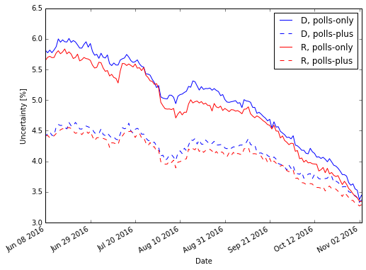

# Uncertainty in FiveThirtyEight popular vote prediction

*Reinier van Mourik, 2016-11-03*

The FiveThirtyEight prediction model of the [2016 presidential election](http://projects.fivethirtyeight.com/2016-election-forecast/) has promised that the uncertainty in their model will decrease as the election date nears.  With that, *all else being equal*, I expect that the probabilities of the candidates winning the election should diverge, that is that Hillary, who's leading the polls, should see her probability start to curve upward to 100% and Trump should see his move closer to 0%.  The opposite has happened in the last week.  This certainly reflects Friday's FBI brief, shaking up the election once again.  So has the uncertainty in fact decreased? 


```python
import requests
import re
import json
import pandas as pd
import numpy as np
import matplotlib.pyplot as plt
from datetime import datetime
%matplotlib inline
```

The data for the plots of FiveThirtyEight's predictions of the national popular vote and electoral college results are in the source code of the webpage as a Javascript variable called `race.statedata`. Each state has its own webpage with its own state data - on the national webpage, `race.statedata` is data for the national polls. Once isolated, it can be read in as a JSON object. 


```python
r = requests.get("http://projects.fivethirtyeight.com/2016-election-forecast/")
jsonstr = re.search("race\.stateData = (\{.*\});", r.text).group(1)
jdoc = json.loads(jsonstr)

```

The JSON document contains a few key-value pairs, of which `forecasts` contains the data I'm after.  `jdoc['forecasts']['all']` is a list of forecast objects, one for each date-party pair.  The forecasts for their now-cast, polls, and polls-plus models are given together with margins of error. (I won't bother with the now-cast, since it is an aggresive model that entertains the question what would happen if the election were held today rather than on Election Day)


```python
df = pd.DataFrame([(pd.to_datetime(f['date']), 
                    f['party'], 
                    f['models']['polls']['lo'],
                    f['models']['polls']['forecast'],
                    f['models']['polls']['hi'],
                    f['models']['plus']['lo'],
                    f['models']['plus']['forecast'],
                    f['models']['plus']['hi'],) for f in jdoc['forecasts']['all']], 
                  columns=("date","party","polls_lo","polls_forecast","polls_hi","plus_lo","plus_forecast","plus_hi")
                 )

```


```python
fig = plt.figure(figsize=(8,6))
ax  = fig.add_subplot(1,1,1)
leg = []
def addPlot(party, color):
    s = df['party']==party
    ax.plot(df[s]['date'], (df[s]['polls_hi']-df[s]['polls_lo'])/2, color=color)
    leg.append(party+', polls-only')
    ax.plot(df[s]['date'], (df[s]['plus_hi']-df[s]['plus_lo'])/2, color=color, linestyle='--')
    leg.append(party+', polls-plus')
addPlot('D','b')
addPlot('R','r')
ax.legend(leg)
ax.set_xlabel("Date")
ax.set_ylabel("Uncertainty [%]")
fig.autofmt_xdate()

```





FiveThirtyEight has kept their promise that the margins tighten as the election approaches. There are a few hiccups along the way, however, specifically around July 13, July 31, and August 14.  July 13's increase in uncertainty accompanied a [sharp decrease in Clinton's polling](http://fivethirtyeight.com/features/election-update-when-to-freak-out-about-shocking-new-polls/) after the FBI came out with a report about her e-mails and police officers were shot in Dallas.  At the end of July, [Clinton received a very real convention bounce](http://fivethirtyeight.com/features/election-update-clintons-bounce-appears-bigger-than-trumps/) that also decreased the model's uncertainty. The uptick around August 14, however, [didn't accompany any moves in the polls](http://fivethirtyeight.com/features/election-update-clintons-lead-is-clear-and-steady/), but it does come at a time when FiveThirtyEight phased out their convention bounce adjustment. 
