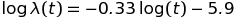

# TicketWatch queuing optimization based on rate of price change

*Reinier van Mourik, 2016-11-08*

The [TicketWatch](http://ticketwatch.xyz) application downloads ticket listings from StubHub for all Bay Area concerts, and all NFL football games.  At any time, I track 600-800 upcoming events.  Because the StubHub API limits me to 10 event listing downloads per minute, it takes over an hour to collect all listings. For many events, prices don't update this often, so a listings download once every two hours is plenty.  But for events coming up very soon, listings change much more frequently, and probing them once every two hours does not capture all of their variability.  And if want to expand my tracking to another event category, tracking several 100 more events and adding more hours to the total time, I would certainly miss many price changes while needlessly grabbing listings for far-in-the-future events.  

The answer is to update events that are sooner more often than later events.  After gathering the list of events for which to download ticket prices, I'll build a queue where sooner events appear several times and events far into the future only once. The relative frequency should mirror the rate of price updates.  So how often do ticket prices on StubHub change, and how does that rate depend on the time-to-event?  

To find out, I analyzed the listings data already in my database.  For each event and timestamp, I store lowest current ticket prices for each zone, but for this analysis I'll look at just the lowest price per timestamp. 

```sql
SELECT l.eventid, e.eventTS-l.timestamp AS timeToEvent, MIN(l.lowestCurrentPrice) 
FROM listings l JOIN events e ON l.eventid=e.id
GROUP BY l.eventid, l.timestamp
ORDER BY l.eventid, l.timestamp
```

After exporting this to CSV, I used MATLAB to import and analyze the data.  I looked at each time interval how long it is, whether the price has changed on that interval, and how long before the event it occurred.

```matlab
listings = importdata('tmp/listings.csv');
dt = (listings(2:end,2)-listings(1:end-1,2))/2;  % time difference from one row to the next
t  = (listings(2:end,2)+listings(1:end-1,2))/2;  % time-to-event of midpoint on that interval
hasChangedPrice = listings(2:end,3)~=listings(1:end-1,3);  % whether lowest ticket price has changed
s  = listings(2:end,1)==listings(1:end-1,1);     % whether adjacent rows have same eventid

% keep only difference rows where eventid has stayed the same
t = t(s); dt = dt(s); hasChangedPrice = hasChangedPrice(s); 

```

To get the frequency of changes as a function of time-to-event, I binned the data both by hour and by day (and by week for time-to-event greater than 28 weeks, where I have less data per day).  In each bin, I calculated the rate of change as the number of time intervals seeing a change divided by the total length of the time intervals.  

```matlab
function [tcenters, y,dy] = rateOfPriceChange(tbins, t, dt, hasChangedPrice )
    tcenters = (tbins(2:end)+tbins(1:end-1))/2; 
    y = tcenters*0; 
    dy = y*0;
    for i=1:length(tcenters); 
        s = (t>=tbins(i) & t<tbins(i+1));
        k = sum(hasChangedPrice(s));
        T = sum(dt(s)); 
        y(i) = k/T; 
        dy(i) = (1/2*chi2inv(0.84, 2*k+2) - k)/T;  % 68% confidence interval
    end; 
end

tbins_day  = (0:189)*24*60*60;
tbins_hour = (0:62*24)*60*60;
[t_day,  y_day, dy_day]  = rateOfPriceChange( tbins_day,  t, dt, hasChangedPrice ); 
[t_hour, y_hour,dy_hour] = rateOfPriceChange( tbins_hour, t, dt, hasChangedPrice );  

% plot
fig = figure(1); clf; set(fig, 'Position', [52, 486, 969, 418]); 
ax1 = subplot(1,3,[2,3]); 

% boundedline from https://www.mathworks.com/matlabcentral/fileexchange/27485-boundedline-m
[hl,hp] = boundedline(t_hour/(24*60*60), y_hour*(24*60*60), dy_hour*(24*60*60), '.-', t_day/(24*60*60), y_day*24*60*60, dy_day*24*60*60, '.-'); 
set(hl(2), 'LineWidth', 2, 'Color', 'r', 'MarkerSize', 12)
set(ax1, 'Box', 'on', 'XDir', 'reverse', 'XLim', [0,62], 'YLim', [0,15]);
xlabel('days to event'); 
ylabel('rate of price change [changes/day]'); 
legend(hl, {'hourly bins', 'daily bins'})

ax2 = subplot(1,3,1); 
tbins_week = 63*24*60*60:7*24*60*60:max(t); 
[t_week, y_week, dy_week] = rateOfPriceChange( t, dt, hasChangedPrice, tbins_week ); 
[hl, hp] = boundedline(t_week/(24*60*60), y_week*(24*60*60), dy_week*(24*60*60), 'r.-'); 
set(ax2, 'Box', 'on', 'XDir', 'reverse', 'XLim', [60,440], 'YAxisLocation', 'right', 'YLim', ylim(ax1));
xlabel('days to event'); 
legend(hl, {'weekly bins'});
```


More precisely, the number of changes *k* in a time interval of length *dt* at time-to-event *t* is Poisson distributed with mean , and the estimate of the parameter  for a time bin centered at *t* is simply 

 

for all data in that bin, where *k* is 0 if the price has not changed and 1 if it has.  This is how I was able to add a 68% confidence interval in the plot, using the confidence intervals for a [Poisson distribution](https://en.wikipedia.org/wiki/Poisson_distribution#Confidence_interval). 

I've made two assumptions:
* *Price changes are independent and can all be described by the parameter *  I assume the amount of time to the next price change does not depend on whether the change was a purchase or a new listing or how much the price has changed.  This is what allows me to estimate the parameter  by summing over all of the time intervals in each bin.
* *A price only changes 0 or 1 times in a time interval.*  A price change in an interval could mean that the price has changed twice, and a price staying the same could mean that a lower price listing was posted and sold in a time interval.  I assume that the time intervals are short enough that neither of this happens, but it effectively means that my estimate of  is a lower bound.  

The plot for daily bins shows the overall trend, and the hourly plot shows that the rate of change varies throughout the day.  First I looked at the overall trend.  It looks like it could be a power-law relationship, so I redrew the plot on log-log axes.  Since the resulting curve is approximately linear, a power law should fit the data well.  

```matlab
s = t_day<=189*24*60*60; 
logt = log(t_day(s)); 
logy = log(y_day(s)); 
logdy = dy_day(s)./y_day(s); 

ft = fit( logt(:), logy(:), 'poly1', 'Weights', 1./logdy(:) );
disp(ft);

fig = figure(2); clf; ax = axes('Box', 'on'); 
boundedline(logt,logy,logdy,'.-'); 
hold('all'); 
plot(fitresult)
xlabel('log time to event'); 
ylabel('log change rate'); 
legend off;
ylim([-13,-9]);
```
    Linear model Poly1:
    ft(x) = p1*x + p2
    Coefficients (with 95% confidence bounds):
      p1 =     -0.3334  (-0.3543, -0.3124)
      p2 =      -5.948  (-6.261, -5.635)


A weighted linear fit gives 

, 

which means my estimate of the trend is: 


( is in [1/second] and t is given in [second])

Next, for completeness's sake, I detrended the data to leave the hourly component.  I checked whether the daily and hourly components are additive (by subtracting the trend from the data) or multiplicative (by dividing the data by the trend) and saw that the remainder is roughly periodic under the multiplicative model.  I then collected the hourly data into hour-of-day bins to reveal the fluctuation of the rate of change throughout the day.  

```matlab
y_trend = @(t)0.00261*t.^-(1/3);

y_detrended  = y_hour./y_trend(t_hour); 
dy_detrended = dy_hour./y_trend(t_hour); 

y_hourofday = zeros(24,1); 
dy_hourofday = y_hourofday; 
for i=1:24; 
    y_hourofday(i)  = sum(y_detrended(i:24:end)./dy_detrended(i:24:end))/sum(1./dy_detrended(i:24:end)); 
    dy_hourofday(i) = 1/mean(1./dy_detrended(i:24:end));
end; 

% plot
fig = figure(3); set(fig, 'Position', [680, 558, 1120, 420]); clf; 
ax = subplot(1,2,1); set(ax, 'Box', 'on', 'XDir', 'reverse');   
boundedline(t_hour/(24*60*60), y_detrended, dy_detrended, '.-'); 
line(xlim(ax), [1,1], 'color', 'k', 'LineStyle', '--');
xlabel('days to event'); 
ylabel('seasonal component of rate of price change'); 
xlim([0,30]);
```


Note that the hour-of-day in this plot reflects hour-to-event more so than a time of day, so the curve isn't meant to reflect user activity at different times of day.  In fact, the user activity likely depends on time-of-event on the day of and maybe the day before, whereas it likely depends on time-of-day further out.  A proper analysis of the seasonality would use actual timestamps rather than time-to-event data.  But while the daily fluctuation can be taken into account for the queuing frequency, the gain would be relatively mild, so I won't bother with that here. 

Now that I know that the rate of change varies with time-to-event via a -1/3 power, I can determine the relative frequency each event needs to appear in the queue.  It means that, for example, if I want an event one year out to appear once in the queue, an event coming up in 8 hours should appear  times in the queue.  

To implement this (in Python), I set the frequency of an event 365 days away to 1 (and the few events further than a year out as well) and I calculate the required number of appearances for all events, with a limit of 10.3 (the frequency of an event 8 hours away).  To build the queue, I represent it by a number line from 0 to 1, and I drop each event onto it at as many positions as required, evenly spaced along the line.  For example, an event with frequency 5 gets dropped at `[0.1, 0.3, 0.5, 0.7, 0.9]`.  And that's it: downloading listings for events in the resulting order updates upcoming events more frequently than events further out, with a relative frequency that mirrors the actual update frequency of prices. 


```python
import sqlite3

conn = sqlite3.connect('ticketwatch.db')
cu = conn.cursor()
cu.execute("SELECT id, (eventTS-strftime('%s','now'))/86400.0 AS daysToEvent FROM events WHERE status=2")
results = cu.fetchall()
conn.close()

# freqs is a list of tuples (eventid, frequency)
freqs = [(r[0], (min(max(8/24,r[1]),364.9)/365.0)**(-1/3)) for r in results]
queue = []
for f in freqs:
    x = 1/(2*f[1])
    while x<1:
        queue.append((f[0],x))  # tuple eventid and queue position
        x+=1/f[1]

queue.sort(key=lambda q: q[1])
```


Note that the time difference between successive updates of an event won't be determined exactly by the positions along the number line but rather by how many events happen to fall between two successive occurrences of that event in the queue.  In other words, the algorithm doesn't guarantee a perfect queue but with a large number of events it should work well.  To check how well the queue does, I compared the distances in the queue between occurrences of the same event with the rate of change I calculated before for each event. 

```python
import pandas as pd

# group queue by event
queue_df = pd.DataFrame(queue, columns=('eventid','pos'))
queue_grouped = queue_df.groupby('eventid')

# calculate mean and max of differences between queue positions for each event
# note that it's the queue index and not the 'pos' column over which I calculate
# the difference, but I do need to select a column to aggregate over the index. 
queue_pos_diff = queue_grouped['pos'].aggregate({
                   'mean_queue_pos_diff': lambda x: pd.Series(x.index).diff().mean(), 
                   'max_queue_pos_diff':  lambda x: pd.Series(x.index).diff().max()
             })

# merge with frequency-by-event data I calculated earlier 
freq_df  = pd.DataFrame(freqs, columns=('eventid','freq')).set_index('eventid')
queue_vs_freq = pd.concat([ queue_pos_diff, freq_df ], axis=1)


# plot
import matplotlib.pyplot as plt

fig,ax = plt.subplots()
plt.plot(1/(3600*8.26e-6*queue_vs_freq['freq']), 
         queue_vs_freq[['mean_queue_pos_diff','max_queue_pos_diff']]*6.0/3600, 
     'o')
ax.legend(('mean', 'max'), loc='best')
ax.set_xlabel("Expected time between price changes [hr]")
ax.set_ylabel("Time between queue occurrences [hr]")
plt.show()
```


The plot of the mean shows that the average time between queue positions (6 seconds times the difference between queue indices) follows the expected time between price changes well, but the plot of the maximum cautions that there can be time intervals up to 40% longer than prescribed (but also shorter).  

TicketWatch now queues listing downloads according to this scheme, collecting more data points where prices change quickly and wasting fewer downloads on events where they don't.  This will capture more details of the price evolution of tickets and ultimately will help make better forecasts.  

